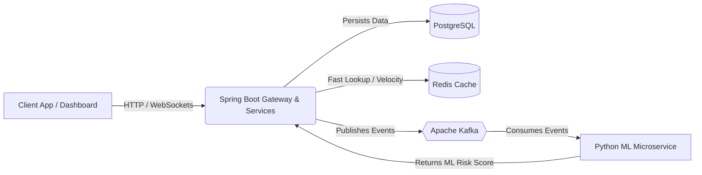
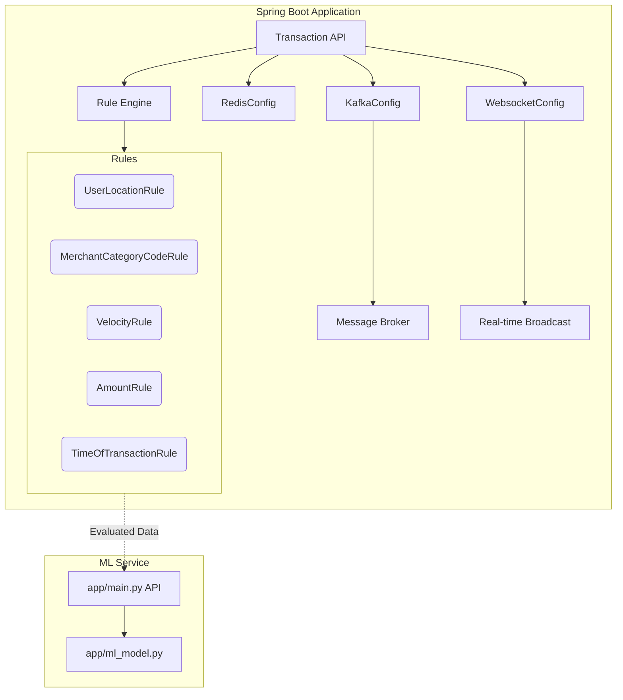

<h1 align="center">
  🛡️ Sentinel Fraud Detection Suite 🛡️
</h1>

<p align="center">
  <strong>A Cutting-Edge, Real-Time Fraud Detection System Powered by Machine Learning & Streaming Architectures</strong>
</p>

<p align="center">
  
</p>

---

## 🌟 Overview

Welcome to **Sentinel** — an advanced, lightning-fast fraud detection engine built to safeguard your financial transactions. By combining the rock-solid reliability of Spring Boot, the blazing speed of Redis, the robust message streaming of Kafka, the persistence of PostgreSQL, and the analytical power of a Python-based Machine Learning Microservice, Sentinel acts as an unyielding shield against fraudulent activities.

---

## 🚀 Key Features & Tech Stack

- **Real-Time Processing**: Leverages **Kafka** for high-throughput, low-latency event streaming.
- **Lightning Fast Rules Engine**: Uses **Redis** for sub-millisecond data retrieval and state management.
- **Intelligent Risk Scoring**: Integrates a dedicated **Python ML Microservice** to provide adaptive, AI-driven risk assessments.
- **Robust Persistence**: Relies on **PostgreSQL** for secure, ACID-compliant data storage.
- **Enterprise-Grade Backend**: Powered by **Java 17 & Spring Boot 3**.
- **Interactive Dashboard**: Real-time websocket-driven UI to monitor and analyze risks as they happen.

---

## 🏗️ Architecture

### 🌐 High-Level Architecture Diagram



### ⚙️ Low-Level Architecture (Java Components)



---

## 📁 Project Structure

```text
Sentinel/
├── ml-service/                 # Python Machine Learning Microservice
│   ├── app/
│   │   ├── __init__.py
│   │   ├── config.py
│   │   ├── feature_engineering.py
│   │   ├── main.py             # FastAPI/Flask entry point
│   │   └── ml_model.py         # Model loading and inference
│   ├── models/                 # Saved ML models
│   ├── Dockerfile
│   ├── requirements.txt
│   └── train_model.py          # Script to train the model
├── src/                        # Spring Boot Java Application
│   ├── main/java/com/example/Sentinel/
│   │   ├── config/             # Kafka, Redis, WebSockets configuration
│   │   ├── controller/         # REST API Endpoints
│   │   ├── dto/                # Data Transfer Objects
│   │   ├── entity/             # JPA Entities (PostgreSQL)
│   │   ├── repo/               # Spring Data JPA Repositories
│   │   ├── rules/              # Fraud Detection Rules (Location, Velocity, etc.)
│   │   └── services/           # Business Logic
│   └── test/                   # Unit & Integration Tests
├── docker-compose.yml          # Container orchestration
├── pom.xml                     # Maven dependencies
└── Sentinel_Postman_Tests_Version2.json # Curated Test Suite
```

---

## 🎥 Demo Video

**Watch Sentinel in action!**

[🔗 Click here to view the Google Drive Demo Video](#) *(Placeholder for Google Drive Link)*

---

## 📸 Screenshots

Here is a glimpse of the Sentinel Dashboard in action:

### Real-Time Alerts & Analytics


### User Details Lookup


### Transaction Search & History


### Risk Assessment & Flagging


### Detailed Transaction View


---

## 🔌 Example API Usage

### 1. Create a User

**Request:**
```http
POST /users/add
Content-Type: application/json

{
  "email": "alice@example.com",
  "phoneNumber": "9876543210",
  "name": "Alice Johnson",
  "homeLocation": "Mumbai"
}
```

**Response (200 OK):**
```json
{
  "userId": 1,
  "email": "alice@example.com",
  "phoneNumber": "9876543210",
  "name": "Alice Johnson",
  "homeLocation": "Mumbai",
  "createdAt": "2026-03-07T14:00:00"
}
```

### 2. Check a Transaction

**Request:**
```http
POST /transaction/check
Content-Type: application/json

{
  "requestId": "txn-001",
  "amount": 500.00,
  "locationOfUser": "Mumbai",
  "timeOfPayment": "2026-03-07T14:30:00",
  "merchantId": 3,
  "userId": 1,
  "merchantCategoryCode": 5411,
  "crossBorder": false,
  "deviceFingerPrint": "device-alice-laptop"
}
```

**Response (200 OK):**
```json
{
  "transactionId": "txn-001",
  "status": "APPROVED",
  "riskScore": 15.5,
  "riskLevel": "LOW",
  "flags": []
}
```

---

## 🧪 Testing the Suite

We have meticulously curated a comprehensive **Postman Collection** (`Sentinel_Postman_Tests_Version2.json`) to thoroughly test every aspect of the system.

This suite includes specific, crafted requests to validate:
- **Velocity Rules**: Testing high frequency transactions within a short time window.
- **Location Rules**: Detecting anomalous geographical jumps.
- **Structuring Rules**: Identifying attempts to bypass large-sum alerts by breaking them into smaller amounts.
- **Amount & Time Rules**: Flagging unusual amounts or late-night operations.
- **Device Fingerprinting**: Tracking unexpected device changes.

**To run the tests:**
1. Import `Sentinel_Postman_Tests_Version2.json` into Postman.
2. Execute the folders in order to see the rules engine and ML model seamlessly identify and flag suspicious behavior.

---
<p align="center">
  <i>Built with ❤️ for a safer financial ecosystem.</i>
</p>
