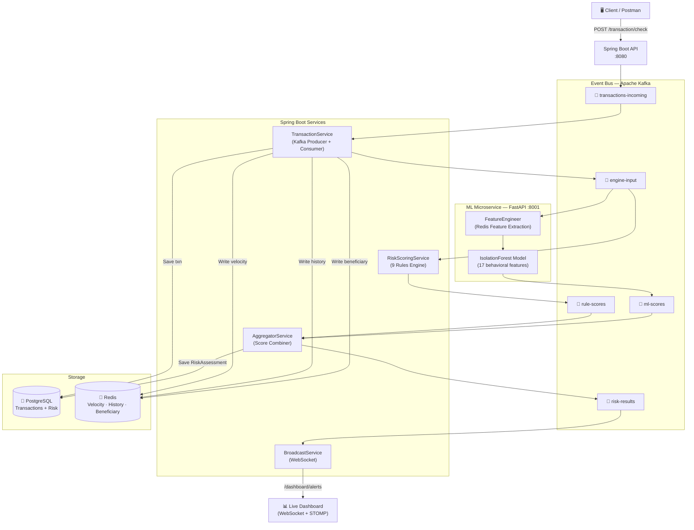
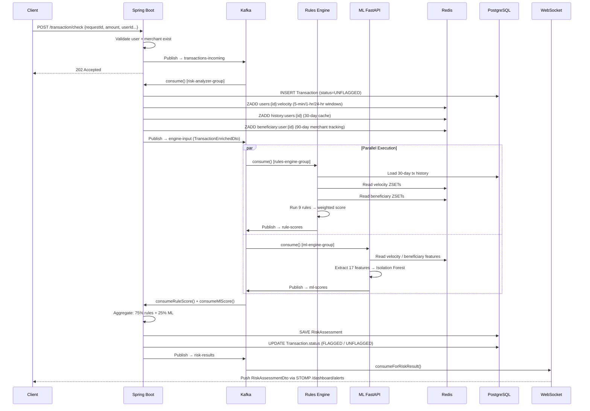
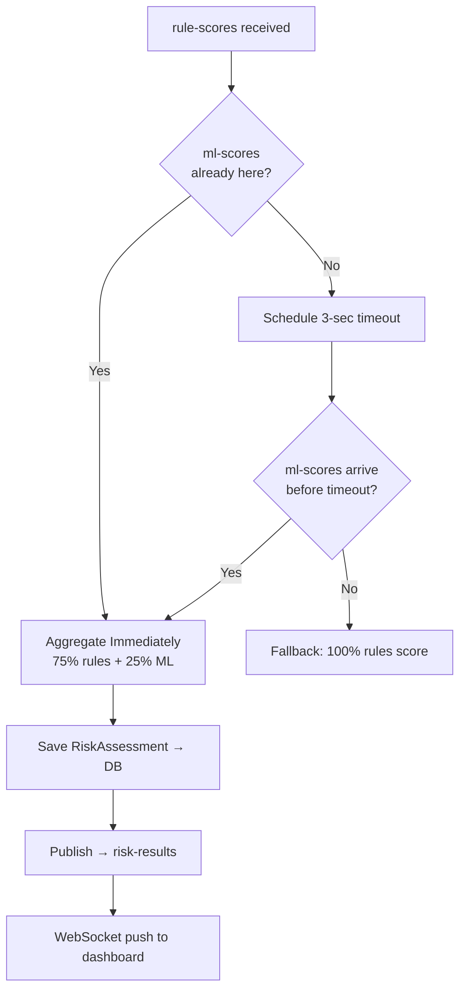

# 🛡️ Sentinel — Real-Time Fraud Detection System

<div align="center">


> **Every transaction. Every millisecond. Every threat.**
>
> Sentinel is a production-grade, event-driven transaction anomaly scoring engine that scores financial transactions in real time using a dual-engine approach — a 9-rule deterministic engine running in parallel with a live ML microservice — aggregating both into a single verdict, streamed to a live dashboard over WebSockets.

[Architecture](#-architecture) • [Rules Engine](#-rules-engine) • [ML Service](#-ml-microservice) • [API Docs](#-api-documentation) • [Testing](#-testing) • [Setup](#-quick-start)

---

## 🎥 Demo Video

**Watch Sentinel in action!**

[🔗 Click here to view the Google Drive Demo Video](#) *(https://drive.google.com/file/d/1HYvNNlW45PMOqGAbC7aJ-7r429RszniW/view?usp=sharing)*

---

## 📸 Screenshots

Here is a glimpse of the Sentinel Dashboard in action:

### Real-Time Alerts & Analytics


### User Details Lookup


### Transaction Search & History


### Risk Assessment & Flagging


### Detailed Transaction View


---

## ⚡ What Makes Sentinel Different

| Feature | Sentinel |
|---|---|
| **Processing Model** | Fully async, event-driven via Apache Kafka |
| **Scoring Engines** | 9 rule-based checks + Isolation Forest ML model — run in **parallel** |
| **Weighting** | 75% rules · 25% ML · graceful timeout fallback |
| **Velocity Tracking** | Redis ZSET sliding windows: 5-min · 1-hr · 24-hr |
| **AML Patterns** | Structuring detection · Beneficiary/mule analysis · 90-day tracking |
| **Real-time Output** | WebSocket push to live dashboard on every verdict |
| **Idempotency** | Duplicate `requestId` silently ignored — safe for retries |
| **DB Write Authority** | **Only Spring Boot writes to the database** — ML service is read-only |

---

## 🏗️ Architecture

### High-Level Architecture



---

### Low-Level Architecture — Data Flow



---

### Aggregator Timeout Logic



--

## 📁 Full Project Structure

```
Sentinel/
│
├── 📄 docker-compose.yml           # Zookeeper + Kafka + Redis
├── 📄 pom.xml                      # Spring Boot 3.5 deps
│
├── 🐍 ml-service/                  # Python FastAPI ML Microservice
│   ├── Dockerfile
│   ├── requirements.txt
│   ├── train_model.py              # Isolation Forest training script
│   ├── models/
│   │   ├── fraud_model.pkl         # Trained model artifact
│   │   ├── scaler.pkl              # StandardScaler artifact
│   │   └── feature_schema.json     # 17-feature strict schema
│   └── app/
│       ├── main.py                 # FastAPI app + Kafka consumer/producer
│       ├── ml_model.py             # IsolationForest wrapper
│       ├── feature_engineering.py  # Redis-backed feature extraction
│       └── config.py               # Pydantic settings
│
└── ☕ src/
    └── main/
        ├── resources/
        │   ├── application.properties
        │   └── static/
        │       └── index.html      # Built-in Sentinel Dashboard UI
        │
        └── java/com/example/Sentinel/
            │
            ├── SentinelApplication.java
            ├── WebConfig.java              # CORS config
            │
            ├── 🎛️ config/
            │   ├── KafkaConfig.java        # 5 topics + 5 consumer factories
            │   ├── RedisConfig.java        # StringRedisSerializer setup
            │   ├── WebsocketConfig.java    # STOMP endpoint config
            │   └── MccRegistry.java        # MCC risk level map
            │
            ├── 🌐 controller/
            │   ├── TransactionController.java
            │   ├── UserController.java
            │   └── DashboardController.java
            │
            ├── 📦 dto/
            │   ├── MoneyTransferDto.java       # Inbound request
            │   ├── TransactionEnrichedDto.java # Internal Kafka msg
            │   ├── RuleScoreDto.java           # Rules engine output
            │   ├── MlScoreDto.java             # ML service output
            │   ├── RiskAssessmentDto.java      # Final verdict
            │   ├── TransactionDto.java
            │   └── UsersDetailDto.java
            │
            ├── 🗄️ entity/
            │   ├── Transaction.java
            │   ├── Users.java
            │   └── RiskAssessment.java
            │
            ├── 🗃️ repo/
            │   ├── TransactionRepo.java
            │   ├── UsersRepo.java
            │   └── RiskAssessmentRepo.java
            │
            ├── ⚖️ rules/                       # 9 Pluggable Rule Classes
            │   ├── AmountRule.java             # Z-score deviation
            │   ├── VelocityRule.java           # Redis ZSET sliding windows
            │   ├── UserLocationRule.java        # Location frequency %
            │   ├── TimeOfTransactionRule.java  # Hour-of-day pattern
            │   ├── MerchantCategoryCodeRule.java # MCC risk level
            │   ├── CrossBorderRule.java        # International flag
            │   ├── DeviceFingerPrintRule.java  # Device frequency %
            │   ├── StructuringRule.java        # AML structuring detection
            │   └── BeneficiaryRule.java        # Mule account detection
            │
            └── 🔧 services/
                ├── TransactionService.java     # Core orchestrator
                ├── RiskScoringService.java     # Rules aggregation
                ├── AggregatorService.java      # ML + Rules combiner
                └── BroadcastService.java       # WebSocket broadcaster
```

---

## ⚖️ Rules Engine

Sentinel runs **9 deterministic rules** on every transaction. Each rule produces a score; scores are combined using a calibrated weighted formula.

### Rule Scoring Table

| Rule | Max Score | Signal | Threshold |
|------|:---------:|--------|-----------|
| **Amount Rule** | 40 | Z-score vs. 30-day history | >3σ = 40pts |
| **Velocity Rule** | 35 | Redis ZSET count in windows | >6 txn/5min = 35pts |
| **Structuring Rule** | 80 | AML near-threshold clustering | 5+ txns 70k-100k in 48hr |
| **Merchant Category** | 30 | MCC risk level + novelty | Gambling = 30pts |
| **Beneficiary Rule** | 30 | Mule detection via 90-day ZSET | >7 unique merchants/24hr |
| **Time Rule** | 25 | Hour-of-day pattern | 2AM–5AM unseen = 25pts |
| **Location Rule** | 10 | Location frequency % | <60% familiar = 10pts |
| **Device Fingerprint** | 10 | Device frequency % | <60% familiar = 10pts |
| **Cross-Border** | 10 | International flag | Any cross-border = 10pts |

### Weighted Score Formula

```
weighted = (amountScore × 0.20)
         + (velocityScore × 0.15)
         + (locationScore × 0.10)
         + (mccScore × 0.10)
         + (timeScore × 0.10)
         + (crossBorderScore × 0.05)
         + (deviceScore × 0.10)
         + (structuringScore × 0.10)
         + (beneficiaryScore × 0.10)

scaledScore = (weighted / 32.25) × 100

if nonZeroRules ≥ 5 → scaledScore × 1.35   ← multi-rule amplifier
if nonZeroRules ≥ 3 → scaledScore × 1.20

ruleScore = min(scaledScore, 100)
```

### Final Aggregated Score

```
finalScore = (ruleScore × 0.75) + (mlScore × 0.25)   ← both engines present
           = ruleScore                                 ← ML timed out (graceful)
           = mlScore                                   ← rules timed out

fraudLevel: LOW (0–35) | MEDIUM (36–50) | HIGH (51–100)
```

---

## 🤖 ML Microservice

A standalone **Python FastAPI** service that consumes the `engine-input` Kafka topic and publishes scores to `ml-scores`.

### Feature Engineering (17 Features)

```
Amount Features:       amount_zscore, amount_percentile
Velocity Features:     velocity_5min, velocity_1hr, velocity_24hr, velocity_burst_score
Merchant Features:     merchant_seen_before, unique_merchants_24hr, merchant_diversity_score
Device Features:       device_seen_before, device_novelty_score
Location Features:     location_seen_before, location_novelty_score
Time Features:         hour_of_day, is_unusual_hour, hour_deviation_score
Border Feature:        is_cross_border
```

All features are extracted from **live Redis data** — no simulation, no stale data.

### Model

```
Algorithm:     Isolation Forest (sklearn)
Training Data: 10,000 synthetic samples (90% legit / 10% fraud)
Scaler:        StandardScaler
Output:        fraud_score (0–100%), confidence, prediction_class
```

### Training the Model

```bash
cd ml-service
python train_model.py
# Generates: models/fraud_model.pkl, models/scaler.pkl, models/feature_schema.json
```

---

## 🗃️ Redis Data Model

Three independent ZSET namespaces power real-time risk signals:

| Key Pattern | Purpose | TTL Window |
|---|---|---|
| `users:{id}:velocity` | Transaction count for velocity rule | 24 hours |
| `history:users:{id}` | Transaction ID cache for 30-day lookups | 30 days |
| `beneficiary:user:{id}` | Merchant IDs for mule detection | 90 days |

```
ZADD users:1:velocity    <epoch_ms>  <txnId>   → 5-min / 1-hr / 24-hr ZCOUNT
ZADD history:users:1     <epoch_ms>  <txnId>   → rangeByScore for DB fallback
ZADD beneficiary:user:1  <epoch_ms>  <merchantId> → unique merchant count
```

---


## 📡 API Documentation

### User Management

#### Create User
```http
POST /users/add
Content-Type: application/json

{
  "email": "alice@example.com",
  "phoneNumber": "9876543210",
  "name": "Alice Johnson",
  "homeLocation": "Mumbai"
}
```
```json
201 Created
"User created..."

409 Conflict
"User already existed"
```

#### Get User Details
```http
GET /users/userdetails?user_id=1
```
```json
200 OK
{
  "userId": 1,
  "email": "alice@example.com",
  "name": "Alice Johnson",
  "phoneNumber": "9876543210",
  "homeLocation": "Mumbai",
  "createdAt": "2026-03-07T10:00:00"
}
```

---

### Transaction Flow

#### Submit Transaction for Fraud Check
```http
POST /transaction/check
Content-Type: application/json

{
  "requestId": "txn-001",
  "amount": 85000.00,
  "locationOfUser": "Mumbai",
  "timeOfPayment": "2026-03-07T03:00:00",
  "merchantId": 4,
  "userId": 1,
  "merchantCategoryCode": 7995,
  "crossBorder": true,
  "deviceFingerPrint": "device-unknown-hacker"
}
```
```json
202 Accepted
"transaction accepted"
```

> The response is immediate. The actual fraud score is computed asynchronously and pushed to the WebSocket dashboard.

#### Get Transaction Details
```http
GET /transaction/details?transactionId=1
```
```json
200 OK
{
  "transactionId": 1,
  "userId": 1,
  "amount": 85000.00,
  "merchantId": 4,
  "userLocation": "Mumbai",
  "timeOfTransaction": "2026-03-07T03:00:00",
  "status": "FLAGGED",
  "merchantCategoryCode": 7995,
  "crossBorder": true,
  "deviceFingerPrint": "device-unknown-hacker"
}
```

#### Top 10 Recent Transactions for User
```http
GET /transaction/top10ForUser?userId=1
```

#### Last 30 Days Transactions for User
```http
GET /transaction/Last30ForUser?userId=1
```

---

### Dashboard Endpoints

#### Full History (for dashboard restore)
```http
GET /dashboard/history
```
```json
200 OK
[
  {
    "id": 1,
    "transactionId": 42,
    "userId": 1,
    "amount": 85000.00,
    "amountScore": 40,
    "velocityScore": 35,
    "locationScore": 10,
    "timeScore": 25,
    "merchantCategoryScore": 30,
    "crossBorderScore": 10,
    "deviceFingerPrintScore": 10,
    "structuringScore": 30,
    "beneficiaryScore": 15,
    "sequenceScore": 0,
    "overallScore": 94.7,
    "mlScore": 78.3,
    "fraudPossibility": "HIGH",
    "triggeredRules": [
      "Amount Rule",
      "Velocity Rule",
      "Structuring Rule",
      "Cross Border Rule",
      "Merchant Category Rule",
      "Device Finger Print Rule",
      "Time Of Transaction Rule",
      "ML Model Alert"
    ]
  }
]
```

#### Risk by Transaction
```http
GET /dashboard/riskByTransaction?transactionId=42
```

---

### ML Service Endpoints

#### Health Check
```http
GET http://localhost:8001/health
```
```json
{
  "status": "healthy",
  "service": "ML Fraud Detection Service",
  "model_version": "fraud-detector-v1.0",
  "model_type": "Behavioral Anomaly Detection"
}
```

#### Manual Predict
```http
POST http://localhost:8001/predict
Content-Type: application/json

{ ...transaction fields... }
```
```json
{
  "fraudScore": 78.3,
  "confidence": 0.82,
  "predictionClass": "FRAUD",
  "modelVersion": "fraud-detector-v1.0",
  "extractedFeatures": { ... }
}
```

---

## 🧪 Testing

### Postman Test Suite

A curated, **production-quality Postman collection** is included: `Sentinel_Postman_Tests_Version2.json`

Import it directly into Postman. **Execute folders in order** — each section builds state for the next.

```
📁 1. User Management
   ├── 1.1  Create User - Alice (Valid)
   ├── 1.2  Create User - Duplicate Email        → expects 409
   ├── 1.3a Create User - Bob
   ├── 1.3b Create User - Merchant 1 (Electronics)
   ├── 1.3c Create User - Merchant 2 (Gambling)
   ├── 1.3d Create User - Merchant 3 (Grocery)
   ├── 1.4  Get User Details - Valid ID 1
   ├── 1.5  Get User Details - Invalid ID 999    → expects 400
   ├── 1.6  Create User - Invalid Email          → expects 400
   └── 1.7  Create User - Invalid Phone          → expects 400

📁 2. Basic Transaction Flow
   ├── 2.1  Normal Transaction - Low Risk
   ├── 2.1b Verify Transaction Details (ID=1)
   ├── 2.2  Duplicate RequestId - Idempotency    → silent no-op
   ├── 2.3  Transaction - Non-existent User      → expects 500
   └── 2.4  Transaction - Non-existent Merchant  → expects 500

📁 3. Amount Rule Testing
   ├── 3.1a–e Build Baseline (1000, 1200, 900, 1100, 1050)
   ├── 3.2    Moderate Amount (1σ–2σ) → score 10
   ├── 3.3    High Amount (2σ–3σ)     → score 25
   └── 3.4    Very High Amount (>3σ)  → score 40

📁 4. Velocity Rule Testing
   ├── 4.1    Normal Velocity Baseline
   ├── 4.2a–e 5-min Velocity (1–5 txns) → score 0
   ├── 4.3    6th txn in 5 min          → score 15
   └── 4.3b   7th txn in 5 min          → score 35

📁 5. Location Rule Testing
   ├── 5.1a–j Build Mumbai baseline (10 consistent txns)
   ├── 5.2    Moderate - Delhi           → score 5
   ├── 5.2b   Moderate - Delhi (2nd)    → score 5
   └── 5.3    Suspicious - Kolkata      → score 10

📁 6. Time Rule Testing
   ├── 6.1    Normal Business Hours (2PM) → score 0
   ├── 6.2    Unusual Hours (3AM)         → score 25
   └── 6.3    Off-hours (8PM)             → score 15

📁 7. MCC Rule Testing
   ├── 7.1    Low-Risk MCC (Grocery 5411)  → score 5
   ├── 7.2    Medium-Risk MCC (Travel 4722) → score 15
   ├── 7.3    High-Risk MCC (Gambling 7995) → score 30
   └── 7.4    Unknown MCC (9999)            → score 10

📁 8. Cross-Border Rule Testing
   ├── 8.1    Domestic Transaction → score 0
   └── 8.2    Cross-Border         → score 10

📁 9. Device Fingerprint Rule Testing
   ├── 9.1a–j Consistent Device (10 txns with same fingerprint) → score 0
   ├── 9.2    Moderate - New Phone  → score 5
   └── 9.3    Suspicious Unknown Device → score 10

📁 10. Structuring Rule Testing (AML)
   ├── 10.1   Normal single txn (50k)      → no flag
   ├── 10.2a–e Rapid Near-Threshold 5 txns (75k–85k in 2hr) → score 30
   └── 10.3   Cumulative >10L (650k)       → score 50+

📁 11. Beneficiary Rule Testing (Mule Detection)
   ├── 11.1   Normal - Existing Merchant  → score 0–5
   ├── 11.2a–b 24-hr Merchant Velocity    → score 5–10
   ├── 11.3a  High Value to New Beneficiary 1 (25k) → score elevated
   └── 11.3b  High Value to New Beneficiary 2 (30k) → score elevated
```

### Import Instructions

```bash
# 1. Open Postman
# 2. Click Import → Upload File → select Sentinel_Postman_Tests_Version2.json
# 3. Set environment variable: baseUrl = http://localhost:8080
# 4. Run folders in sequence 1 → 11
```

---

## ✨ Features

### 🎯 Core Capabilities

| | Feature | What it does |
|:---:|---|---|
| ⚡ | **Dual-Engine Scoring** | 9 rules + Isolation Forest ML run **in parallel**. Weighted 75/25, with 3-sec graceful fallback if either engine lags. |
| 🔄 | **Fully Async Pipeline** | API returns `202 Accepted` instantly. All scoring flows through 5 Kafka topics — zero blocking. |
| 🔴 | **Redis Velocity Windows** | ZSET sliding windows at 5-min · 1-hr · 24-hr per user. Self-pruning on every write — sub-millisecond reads. |
| 🏦 | **AML Structuring Detection** | Flags 5+ near-threshold txns (₹70k–₹1L) within 48hrs, or cumulative volume breaching ₹10L. |
| 🕵️ | **Mule Account Detection** | 90-day rolling ZSET tracks unique merchant relationships. Rapid fan-out to new merchants = red flag. |
| 🔒 | **Idempotent Processing** | `requestId` deduplicates at the DB constraint level — atomic, race-safe, zero extra round trips. |
| 📡 | **Live WebSocket Dashboard** | Every verdict pushed via STOMP/SockJS. Built-in `/index.html` — no frontend build needed. |
| 🛡️ | **Single Write Authority** | Only Spring Boot writes to PostgreSQL. ML service is purely stateless — reads Redis, writes Kafka. |

### 💻 Dashboard Capabilities

| | Capability | Detail |
|:---:|---|---|
| 🚨 | **Live Alert Feed** | Colour-coded 🔴🟡🟢 verdicts streaming in real time with triggered rule badges and ML score |
| 📊 | **Risk Distribution Chart** | Chart.js doughnut — auto-updates on every WebSocket push |
| 🔍 | **Transaction Search** | By txn ID · top-10 per user · 30-day history — all enriched with risk scores |
| 👤 | **User Lookup** | Instant profile fetch — name, email, location, registration date |
| 📈 | **Live Stats Cards** | Total transactions · High-risk count · Avg risk score · Flagged rate |
| 🔄 | **History Restore** | Pulls full DB history on page load — dashboard never starts empty |

---

## ⚡ Performance Optimization

### ✅ Current Optimizations

| Optimization | Impact |
|---|---|
| **Redis-First Reads** | ZSETs serve velocity + history + beneficiary at O(log N). PostgreSQL only hit on cold cache. Rule eval stays under 5ms warm. |
| **True Parallel Engines** | Rules engine and ML service are separate consumer groups on `engine-input`. Neither blocks the other — aggregator merges on first-arrival. |
| **Self-Pruning ZSETs** | `ZREMRANGEBYSCORE` runs on every write — no TTL jobs, no memory bloat, windows stay exact. |
| **Typed Kafka Factories** | 5 dedicated `ConcurrentKafkaListenerContainerFactory` instances — deserialization errors in one topic can't contaminate others. |
| **Lazy Loading + EntityGraph** | `FetchType.LAZY` everywhere. `@EntityGraph` applied surgically only where joins are genuinely needed — eliminates N+1. |
| **DB-Level Idempotency** | Unique constraint on `requestId` — atomic duplicate rejection with no extra SELECT or Redis lock. |
| **ConcurrentHashMap Aggregation** | Pending rule/ML scores held in memory — zero DB reads during the aggregation window, cleaned up immediately after publish. |

### 🚀 Future Performance Targets

- **Kafka partition-by-userId** — Guarantee per-user ordering without global locks
- **Redis Cluster sharding** — Distribute ZSETs across nodes for million-user scale
- **ONNX model serving** — 3–5× faster ML inference, language-agnostic portability
- **PostgreSQL read replicas** — Offload dashboard history reads from the primary write node


---

## 🌐 Deployment Guide

### Infrastructure Overview

| Service | Platform | Free Tier |
|---|---|---|
| Spring Boot API | Back4App Containers | ✅ Yes |
| ML FastAPI Service | Back4App Containers | ✅ Yes |
| Dashboard Frontend | Netlify | ✅ Yes |
| PostgreSQL | Back4App (built-in) | ✅ Yes |
| Redis | Redis Labs (Redis Cloud) | ✅ 30MB free |
| Apache Kafka | Upstash Kafka | ✅ 10k msg/day free |

---

### 1️⃣ Redis — Redis Labs (Redis Cloud)

```
1. Go to https://redis.com/try-free/
2. Create a free database (30MB, no credit card)
3. Copy: Public Endpoint, Password
4. Update application.properties:
```
```properties
spring.data.redis.host=redis-XXXXX.c1.us-east-1-2.ec2.cloud.redislabs.com
spring.data.redis.port=XXXXX
spring.data.redis.password=YOUR_REDIS_PASSWORD
```
```python
# ml-service/app/feature_engineering.py
self.redis_client = redis.Redis(
    host="redis-XXXXX.c1.us-east-1-2.ec2.cloud.redislabs.com",
    port=XXXXX,
    password="YOUR_REDIS_PASSWORD",
    decode_responses=True,
    ssl=True
)
```

---

### 2️⃣ Kafka — Upstash

```
1. Go to https://upstash.com/ → Create Kafka Cluster
2. Create 5 topics manually:
   transactions-incoming · engine-input · rule-scores · ml-scores · risk-results
3. Copy: Bootstrap Server URL, Username, Password
4. Update application.properties:
```
```properties
spring.kafka.bootstrap-servers=YOUR-CLUSTER.upstash.io:9092
spring.kafka.properties.security.protocol=SASL_SSL
spring.kafka.properties.sasl.mechanism=SCRAM-SHA-256
spring.kafka.properties.sasl.jaas.config=org.apache.kafka.common.security.scram.ScramLoginModule required \
  username="YOUR_USERNAME" password="YOUR_PASSWORD";
```
```python
# ml-service/app/config.py — update kafka_bootstrap_servers
# Add SASL config to KafkaConsumer and KafkaProducer in main.py:
security_protocol="SASL_SSL",
sasl_mechanism="SCRAM-SHA-256",
sasl_plain_username="YOUR_USERNAME",
sasl_plain_password="YOUR_PASSWORD"
```

---

### 3️⃣ ML Service — Back4App Containers

```
1. Train model locally first: python train_model.py
   (Commit fraud_model.pkl + scaler.pkl + feature_schema.json to the repo)
2. Go to https://www.back4app.com/ → Containers → New Container
3. Connect your GitHub repo, select the ml-service/ folder
4. Set root directory: ml-service
5. Dockerfile is already present — Back4App auto-detects it
6. Add Environment Variables:
```
```env
KAFKA_BOOTSTRAP_SERVERS=YOUR-CLUSTER.upstash.io:9092
REDIS_HOST=redis-XXXXX.c1.us-east-1-2.ec2.cloud.redislabs.com
REDIS_PORT=XXXXX
REDIS_PASSWORD=YOUR_REDIS_PASSWORD
```
```
7. Deploy → Copy the public URL (e.g. https://ml-service-xxx.b4a.run)
```

---

### 4️⃣ Spring Boot API — Back4App Containers

```
1. Create a Dockerfile in the project root:
```
```dockerfile
FROM eclipse-temurin:17-jdk-alpine AS build
WORKDIR /app
COPY . .
RUN ./mvnw package -DskipTests

FROM eclipse-temurin:17-jre-alpine
WORKDIR /app
COPY --from=build /app/target/*.jar app.jar
EXPOSE 8080
ENTRYPOINT ["java", "-jar", "app.jar"]
```
```
2. Go to Back4App → Containers → New Container
3. Connect GitHub repo (root directory = project root)
4. Add Environment Variables:
```
```env
SPRING_DATASOURCE_URL=jdbc:postgresql://YOUR_PG_HOST:5432/sentinel
SPRING_DATASOURCE_USERNAME=postgres
SPRING_DATASOURCE_PASSWORD=YOUR_PG_PASSWORD
SPRING_DATA_REDIS_HOST=redis-XXXXX.c1.us-east-1-2.ec2.cloud.redislabs.com
SPRING_DATA_REDIS_PORT=XXXXX
SPRING_DATA_REDIS_PASSWORD=YOUR_REDIS_PASSWORD
SPRING_KAFKA_BOOTSTRAP_SERVERS=YOUR-CLUSTER.upstash.io:9092
CORS_ORIGINS=https://your-frontend.netlify.app
```
```
5. Deploy → Copy the public URL (e.g. https://sentinel-xxx.b4a.run)
```

---

### 5️⃣ Frontend Dashboard — Netlify

The dashboard is a single `index.html` in `src/main/resources/static/`. Deploy it independently:

```
1. Copy src/main/resources/static/index.html to a new folder: sentinel-dashboard/
2. Update the API_BASE constant in index.html:
```
```javascript
// Line ~230 in index.html
const API_BASE = 'https://sentinel-xxx.b4a.run';  // Your Back4App URL
```
```
3. Go to https://netlify.com → Sites → Deploy manually
4. Drag-and-drop the sentinel-dashboard/ folder
5. Done — your dashboard is live at https://your-site.netlify.app
```

---

### ✅ Production Checklist

```
☐ Redis Cloud endpoint + password updated in both Spring Boot and ML service
☐ Upstash Kafka SASL credentials set in both services
☐ All 5 Kafka topics created in Upstash dashboard
☐ ML model artifacts committed (fraud_model.pkl, scaler.pkl, feature_schema.json)
☐ CORS_ORIGINS set to your Netlify domain in Back4App env vars
☐ API_BASE in index.html updated to Back4App Spring Boot URL
☐ spring.jpa.hibernate.ddl-auto=update (not create-drop) for prod
☐ H2 console disabled: spring.h2.console.enabled=false
```

---

## 🚀 Quick Start

### Prerequisites

```
Java 17+
Maven 3.9+
Docker + Docker Compose
Python 3.11+
```

### Step 1 — Start Infrastructure

```bash
docker-compose up -d
# Starts: Zookeeper (:2181) · Kafka (:9092) · Redis (:6379)
```

### Step 2 — Train the ML Model

```bash
cd ml-service
pip install -r requirements.txt
python train_model.py
# Generates fraud_model.pkl + scaler.pkl + feature_schema.json
```

### Step 3 — Start the ML Microservice

```bash
uvicorn app.main:app --host 0.0.0.0 --port 8001
```

### Step 4 — Start the Spring Boot Application

```bash
./mvnw spring-boot:run
# API available at http://localhost:8080
# Dashboard at   http://localhost:8080/index.html
# H2 console at  http://localhost:8080/h2-console
```

### Step 5 — Run Tests

Import `Sentinel_Postman_Tests_Version2.json` into Postman and execute all folders in order.

---

## 🛠️ Tech Stack

### Backend (Spring Boot)

| Technology | Version | Role |
|---|---|---|
| Java | 17 | Language |
| Spring Boot | 3.5 | Framework |
| Spring Kafka | Latest | Event streaming |
| Spring Data JPA | Latest | ORM |
| Spring Data Redis | Latest | Redis client |
| Spring WebSocket | Latest | Real-time push |
| H2 | Runtime | Dev in-memory DB |
| PostgreSQL | Latest | Prod DB |
| Jakarta Validation | Latest | Input validation |

### ML Microservice (Python)

| Technology | Version | Role |
|---|---|---|
| FastAPI | 0.109 | REST API + Kafka service host |
| Uvicorn | 0.27 | ASGI server |
| scikit-learn | 1.4 | Isolation Forest model |
| kafka-python | 2.0.2 | Kafka consumer + producer |
| Redis-py | 5.0.1 | Live feature extraction |
| NumPy | 1.26 | Numerical computation |
| Pandas | 2.1 | Synthetic training data |
| Joblib | 1.3 | Model + scaler serialization |
| Pydantic | 2.5 | Schema validation |
| pydantic-settings | 2.1 | Config via env vars |
| python-dotenv | 1.0 | `.env` file loading |

### Infrastructure

| Service | Image | Port |
|---|---|---|
| Apache Kafka | confluentinc/cp-kafka:7.2.1 | 9092 |
| Zookeeper | confluentinc/cp-zookeeper:7.2.1 | 2181 |
| Redis | redis:7-alpine | 6379 |

---

## 🔌 Kafka Topics

| Topic | Partitions | Producer | Consumer | Payload |
|---|:-:|---|---|---|
| `transactions-incoming` | 3 | TransactionController | TransactionService | MoneyTransferDto |
| `engine-input` | 1 | TransactionService | RulesEngine + ML | TransactionEnrichedDto |
| `rule-scores` | 3 | RulesEngine | AggregatorService | RuleScoreDto |
| `ml-scores` | 3 | ML FastAPI | AggregatorService | MlScoreDto |
| `risk-results` | 3 | AggregatorService | BroadcastService | RiskAssessmentDto |

---

## 📊 Risk Scoring Reference

| Overall Score | Fraud Level | Transaction Status |
|:---:|:---:|:---:|
| 0 – 35 | 🟢 LOW | UNFLAGGED |
| 36 – 50 | 🟡 MEDIUM | UNFLAGGED |
| 51 – 100 | 🔴 HIGH | FLAGGED |

### MCC Risk Registry

| MCC Code | Category | Risk Level |
|---|---|---|
| 7995 | Gambling | HIGH |
| 6010, 6011 | Cash Advance / ATM | HIGH |
| 6051 | Crypto / Non-bank | HIGH |
| 4829 | Wire Transfer | HIGH |
| 5732, 5944 | Electronics / Jewelry | MEDIUM |
| 4722, 7011 | Travel / Hotels | MEDIUM |
| 5411, 5912 | Grocery / Pharmacy | LOW |
| 5814, 4111 | Food / Transit | LOW |

---

## 🔐 Validation Rules

All inbound `MoneyTransferDto` fields are validated at the controller layer:

```
amount          → @Positive, @NotNull
locationOfUser  → @NotBlank
timeOfPayment   → @PastOrPresent (no future timestamps)
merchantId      → @NotNull + must exist in DB
userId          → @NotNull + must exist in DB
merchantCategoryCode → @NotNull
crossBorder     → @NotNull
deviceFingerPrint → @NotBlank
requestId       → @NotBlank (idempotency key)
```

---

## 📈 Future Roadmap

- [ ] **PostgreSQL for Prod** — Replace H2 with persistent PostgreSQL; switch `ddl-auto` to `update`
- [ ] **Auto ML Retraining** — Nightly pipeline retrains Isolation Forest on newly flagged transactions
- [ ] **Sequence Rule** — Score unnatural transaction ordering patterns (rapid round-trips, fan-out)
- [ ] **Rate Limiting** — Per-user API throttling via Bucket4j to block transaction flooding
- [ ] **Alert Workflow** — Acknowledge / escalate / dismiss alerts directly from the dashboard
- [ ] **Grafana Metrics** — Kafka consumer lag, rule hit rates, ML latency via Prometheus + Grafana
- [ ] **SHAP Explainability** — Surface top contributing features per ML prediction on the dashboard

---

## 📝 License

Distributed under the **MIT License**. See `LICENSE` for more information.

---

<div align="center">

### ⭐ Star this repo if you found it cool!

**Built with ☕ Java + 🐍 Python · Event-driven with Apache Kafka · Real-time with WebSockets**
